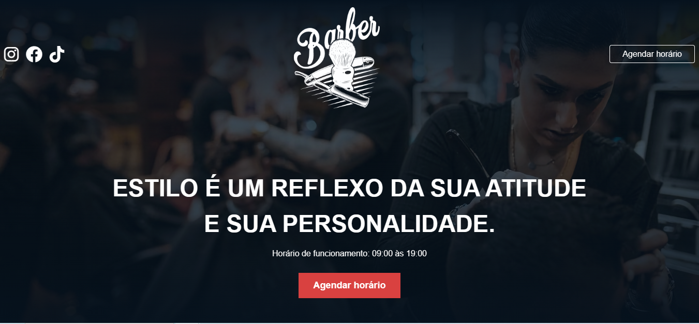

# Barber

  

## 💻 Projeto

Esse é um projeto web Responsivo de uma barbearia. Projeto realizado conforme video-aula do "Sujeito-Programador".

## 🚀 Tecnologias

Esse projeto foi desenvolvido durante o NLW: SpaceTime da Rocketseat com as seguintes tecnologias:

-HTML

-CSS

-GIT

-GITHUB

-SCSS

## 🏷️Layout

Projeto da video aula [sujeito_programador](https://www.youtube.com/watch?v=Fzc_dnqD-V0)
